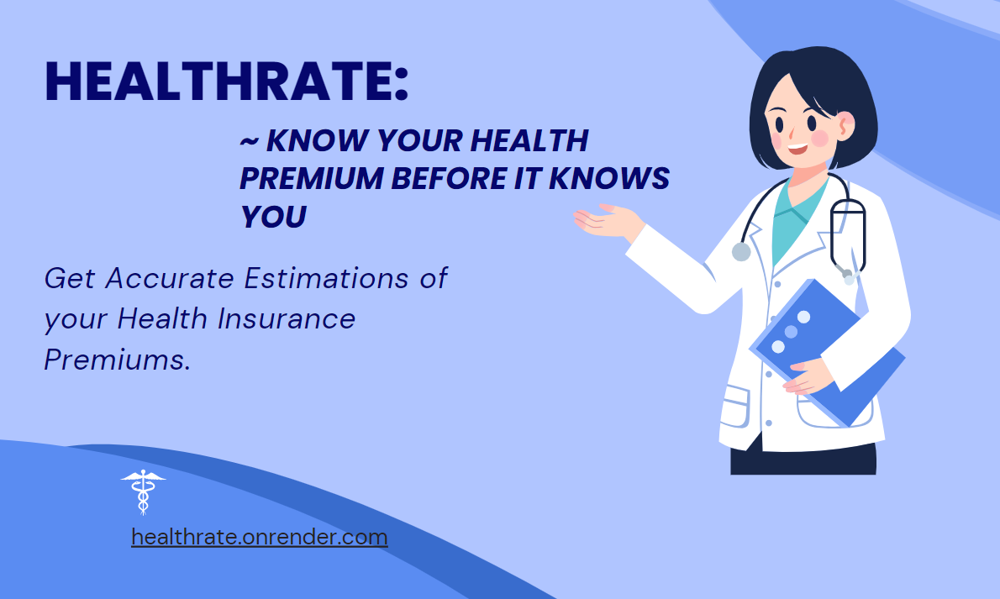

  
Banner [source](https://banner.godori.dev/)

# Health Insurance Premium Calculator:

#### App Link:(https://healthrate.onrender.com)

---

## Overview:
An intelligent, real-time health insurance premium predictor designed to help individuals estimate their annual premiums based on their health conditions, age, income, and more. Powered by XGBoost and built with an interactive Streamlit interface for instant predictions. Enables better financial planning and awareness of health-related costs.

---

## 🔍 Business Problem:
Health insurance costs vary widely based on individual risk factors. This app uses machine learning to generate accurate premium predictions, helping users plan ahead and understand how their personal and medical data affect insurance pricing.

---

## Key Insights:

### 1. Age-Based Segmentation
- Users aged ≤25 showed higher variance in premium predictions.
- Introduced segmented modeling to improve accuracy by age group.

### 2. Feature Engineering:
- Custom `risk_score` derived from medical history.
- `genetical_risk` introduced to reduce error in younger users.
- Age-based segmentation yielded performance uplift.

### 3. Error Analysis:
- Margin of Error calculations showed most variance in younger demographics.
- Model was adapted to address outlier impact.

### 4. Feature Importance:
- XGBoost model revealed income, medical history, and risk_score as top predictors.

---

## ⚙️ Tech Stack:
- Python (3.10+)
- Pandas, NumPy, Matplotlib, Seaborn
- Scikit-learn, XGBoost
- Streamlit (for UI & deployment)
- RandomizedSearchCV (for model tuning)

---

## 🧪 Methods:

### 📥 Data Preprocessing
- Cleaned dataset and isolated `X` and `y` to avoid leakage.
- Applied pipelines independently to test/train splits.

### 📊 EDA
- Histograms, box plots used for univariate analysis.
- Scatter plots and cross-tabs for bivariate insights.

### 🧠 Feature Engineering
- Created `risk_score` from domain-specific medical history.
- Encoded categorical features via One-Hot and Label Mapping.

### 🧮 Feature Selection & Scaling
- Dropped multicollinear features using VIF.
- Applied Min-Max scaling for consistent range.

### 🤖 Model Development
- Trained Linear, Ridge, and XGBoost regressors.
- XGBoost selected for best R² performance (0.98).

### 🛠️ Model Tuning & Segmentation
- Used RandomizedSearchCV for hyperparameter optimization.
- Built two models: one for ≤25, one for >25 age group.

---

## 📈 Evaluation Metrics
- **R² Score (XGBoost):** 0.98  
- **Error Margin:** Minimized after age-wise segmentation  
- **Feature Impact:** Income, risk_score, and genetical_risk were most influential  
- **Model Strategy:** Balanced simplicity with high accuracy for real-world usability

---

## 📌 Key Findings:
- Premiums are strongly influenced by medical history and income level.
- Segmented model approach significantly improved younger user predictions.
- Added domain-specific features resulted in more robust generalization.

---
> 🚀 **Final solution: A dual-model XGBoost system optimized for different age groups, served through an interactive and responsive Streamlit app.**
=======

